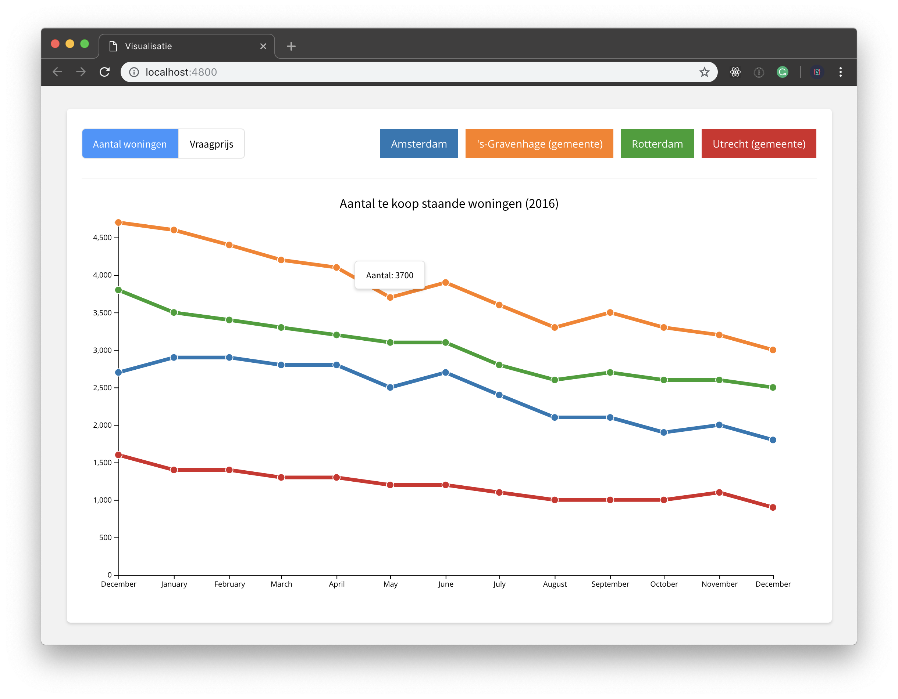

# Functional Programming course



## Table of Contents

* [Short notice](#short-notice)
* [My progress](#my-progress)
  * [Intro](#intro)
  * [Making choices](#making-choices)
  * [Data](#data)
  * [The chart code](the-chart-code)
  * [Cleaner code](#cleaner-code)
* [Features](#features)
* [Recourses](#recourses)

## Short notice

I'm following a course at the Hogeschool van Amsterdam. The course is focussed on the use of D3.js and external data. With this course comes some learning goals which I will accomplish by doing an assessment. In the readme, I will describe my progress and what I did to come up with this result. The actual result can be found in the [app](app/) folder.

## My progress

### Intro

I need to be honest... This course is haunting me since day one. This is the third time I'm following this course because I failed the times before. But I do get better at it each time so that's worth something. Well back to the point. I couldn't attend the lectures at school because I'm doing an internship at the moment. To refresh my knowledge about D3 I followed a course on [udemy](https://www.udemy.com/learn-d3js-for-data-visualization/) instead. This course helped me to understand `scales`, `SVG`, `loading data`, different charts types and using D3 on the server side. I followed almost all section on this course and it helped me a lot. I wrote a couple of [notes](notes/) to help me remind what I learned. My [working log](log.md) is explaining better how I progressed through this online course. As you would understand, a lot of code that has been explained in the online course is being used in my visualization. But I will note what I reused and what I did myself.

### Making choices

A requirement for this assessment is that I used NPM for this project. D3 is a frontend library that can be used on the client side without using packages. But I could use Node.js and use the packages from NPM in order to make it work. In the course on Udemy I learned about creating a visualization on the server side. But I didn't see that as a good option. Although it is slightly faster, it doesn't support DOM manipulation that well. So I rather go for the client side version of D3. In the search of integrating NPM in this project I stumbled on an article from [Will Soares](https://dev.to/willamesoares/setting-up-d3js-with-babel-and-webpack-dc3). He made an article about a webpack and babel setup for D3. This was the perfect way to integrate NPM in my project and solved my problem. So I used his setup as a foundation and build my visualization on top of it.

### Data

Another requirement was that I used external data. I paid a visit to the website of [Centraal Bureau voor de statistiek](https://www.cbs.nl/) and searched for interesting data that I could use. After a while, I found [data](http://statline.cbs.nl/Statweb/publication/?DM=SLNL&PA=82452NED) about the housing market in the Netherlands in the year 2016. The data involved houses that were for sale in 4 of the largest cities in the Netherlands. My chart is based on the number of houses that are for sale in each city and how much the average costs are. The data file that I used can be found [here](app/data/data.csv).

### Cleaning the data

For me, this was the hardest part because I failed the last time on this part. Back then I didn't have the skills to clean the data to make it work on the chart eventually. But I got a little help this time from my coworker at my internship. They guided me through the steps of making this data workable. So what did I had to do to make this work:

1. Load the data.
2. Changes the string values that are numbers into data type numbers.
3. Make a date object from the "perioden" values.
4. Filter the data based on the city.

This is where I came up with:

```javascript
// Mapping the months into numbers
const map = {
  "januari": "01",
  'februari': '02',
  'maart': '03',
  'april': '04',
  'mei': '05',
  'juni': '06',
  'juli': '07',
  'augustus': '08',
  'september': '09',
  'oktober': '10',
  'november': '11',
  'december': '12',
}

// Load the data
d3.csv("data/data.csv")
  // Alter the data for each row
  .row(function(data) {

    // Changing the perioden data to from a full month name to a number
    const periods = data.perioden
    const monthSelection = periods.substring(5, periods.length)
    const newMonthValue = map[monthSelection]
    const newperiods = data.perioden.replace(monthSelection, newMonthValue)

    return {
      // Time parse the date with d3.timeParse()
      perioden: timeParse(newperiods),
      regio: data.regio,
      aantal: Number(data.aantal),
      vraagprijs: Number(data.vraagprijs)
    }
  })
  .get(renderChart)

function renderChart (err, dataset) {
  if (!err) {

    // Filter the data based on the cities
    const amsterdam = dataset.filter((d) => {
      return d.regio === "Amsterdam"
    })
  
    const denhaag = dataset.filter((d) => {
      return d.regio === "'s-Gravenhage (gemeente)"
    })
  
    const rotterdam = dataset.filter((d) => {
      return d.regio === "Rotterdam"
    })
  
    const utrecht = dataset.filter((d) => {
      return d.regio === "Utrecht (gemeente)"
    })
  }
}
```

### The chart code

By following the course on Udemy I learned a lot about the basics of D3. I used that knowledge to create the axes, the scales, and the lines and circles. I typed a long the course as it progressed so I could use that code. Although it wasn't copy and paste. I had to change the scales and the attributes in order to make it work for my visualization. But after a while, my `app.js` became really long. It wasn't fun to work with. You know what they say. don't repeat yourself. And that was what I was doing. I refactored the code so I could shrink the number of lines in the file. Here's what I did:

I created a function that I could use for all the cities but with different data.

```javascript
function createLine(data, className, color) {
  svg.append("path")
    .datum(data)
    .attr("class", className)
    .attr('stroke', color)
    .attr('stroke-width', 5)
    .attr('fill', 'none')
    .attr('d', line);
}
```

And called the function 4 times with the correct data:

```javascript
createLine(amsterdam, "amsterdam-line", "green")
createLine(rotterdam, "rotterdam-line", "red")
createLine(denhaag, "denhaag-line", "blue")
createLine(utrecht, "utrecht-line", "yellow")
```

I did the same with the dots on the chart and reused this method when updating the chart based on click events.

To add some interactivity to the chart I added buttons that would trigger different data types. To show the user which dataset he's looking at, I also created an active state with d3. In de Udemy course I learned about the `.classed()` function. That helped me to succeed in this part. Let me demonstrate how that worked out:

```javascript
// Set a initial state for both the buttons to show the user which dataset is active.
d3.select("#amount")
  .attr("class", "active")
  .classed("active", true);

d3.select("#price")
  .attr("class", "active")
  .classed("active", false);

// Trigger a update function for the data based on a click event.
d3.select("#price").on("click", changeToPrice);

function changeToPrice() {
  // Change the state of the buttons.
  d3.select("#amount")
    .attr("class", "active")
    .classed("active", false);

  d3.select("#price")
    .attr("class", "active")
    .classed("active", true);

  // Here you place the rest of the code that has been changed.
}
```

It was also a good idea if I gave the chart a title so users would see what the data is about. Based on the active dataset I changed the title. This is how it works:

```javascript
// Create the title in the chart.
svg
  .append("text")
  .attr("class", "heading-text")
  .attr("y", "40px")
  .attr("x", width / 2)
  .attr("text-anchor", "middle")
  .attr("style", "font-family: 'Noto Sans TC', sans-serif;")
  .text("Aantal te koop staande woningen (2016)");

...

function changeToPrice() {
  // Update the title with the new text.
  d3.select("text.heading-text").text("Gemiddelde verkoopprijs (2016)");
}
```

I also figured out that hardcoding in D3 is bad practice in some situations. I used 4 lines that needed different colors, but doing that hardcoded was good for testing, but not an end result. In the Udemy course they mentioned the `d3.scaleOrdinal()` that has been used for colors many times. Together with a set of scheme colors from D3 I created an array of colors:

```javascript
// Set the color scaling.
// Use the d3.schemeCategory10 color scheme.
const color = d3.scaleOrdinal(d3.schemeCategory10);

// Used the color() functions to return the colors from the array.
.attr("fill", (d, i) => {
  return color(i);
})
```

To see which color belongs to which city I needed a legend. Without that the user wouldn't recognize where the data is about. First I wanted to hardcode it. But then I thought, naaah this should be rendered by D3. But there was a problem. I needed a way to find all the unique values based on the key d.regio. Luckily I found a solution (surprisingly) on [StackOverflow](https://stackoverflow.com/questions/28572015/how-to-select-unique-values-in-d3-js-from-data). I could use the d3.map().keys() function to get these unique values.

```javascript
// Get the unique values from the dataset.
const legendValues = d3
  .map(dataset, d => {
    return d.regio;
  })
  // Use .keys() to get the actual key values instead of the object.
  .keys();

// Loop trough the legendValues array and put the values in a list item.
d3.select("ul#legend")
  .selectAll("li")
  .data(legendValues)
  .enter()
  .append("li")
  .attr("style", (d, i) => {
    return "background:" + color(i) + ";";
  })
  .text(d => {
    return d;
  });
```

My last addition to chart was tooltips. I wanted to show more detailed information about the data on the chart because it was hard to read. Even with the dots on the lines. I created a `div` and rendered the data as text. That was the easiest part. The hardest part was positioning the tooltip. But I got some inspiration from an example from [Mike Bostock](https://bl.ocks.org/mbostock/1087001) to solve this problem. He used the `d3.event.pageX` and `d3.event.pageY` functions to position the tooltip above the mouse. That was my solution and created this:

```javascript
.on("mousemove", d =>  {
  tooltip
    .style("left", (d3.event.pageX - 50) + "px")
    .style("top", (d3.event.pageY - 50) + "px");
```

### Cleaner code

To make my work a bit cleaner and consistent I used [Prettier](https://prettier.io/). There are many options for making your work cleaner but I wanted to try Prettier and see if this is working for me.

## Features

* `d3.select()`
* `d3.selectAll()`
* `d3.append()`
* `d3.line()`
* `d3.timeParse()`
* `d3.timeFormat()`
* `d3.csv()`
* `d3.scaleTime()`
* `d3.scaleLinear()`
* `d3.scaleOrdinal()`
* `d3.schemeCategory10`
* `d3.axisBottom()`
* `d3.axisLeft()`
* `d3.map()`
* `d3.event`

## Recourses

* [Working log](log.md)
* [Learn d3js for data visualization](https://www.udemy.com/learn-d3js-for-data-visualization/)
* [Setting Up D3.js with Babel and Webpack](https://dev.to/willamesoares/setting-up-d3js-with-babel-and-webpack-dc3)
* [Repo boiler template](https://github.com/willamesoares/learn-d3)
* [Helped me solve conversion](https://stackoverflow.com/questions/24473733/importing-a-csv-into-d3-cant-convert-strings-to-numbers)
* [Data table](https://opendata.cbs.nl/statline/#/CBS/nl/dataset/82452NED/table?ts=1543228096687)
* [Mapping trough the cities](https://stackoverflow.com/questions/28572015/how-to-select-unique-values-in-d3-js-from-data)
* [Making the tooltip position above the mouse](https://bl.ocks.org/mbostock/1087001)

### License

[Valentijn Kap](https://www.valentijnkap.nl) | [GNU General Public License, version 3.](https://opensource.org/licenses/GPL-3.0)